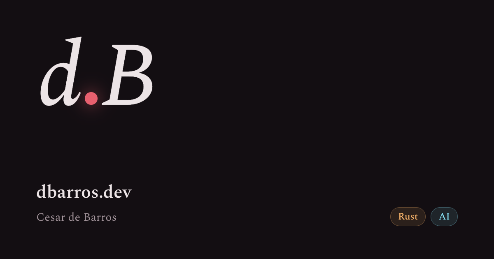

Draft post to check the theme and i18n. It comes out before the site goes live.
The compiler rejected the code until I moved the `Vec<String>` inside the
closure, as explained in [the documentation](https://doc.rust-lang.org/book/).

## Borrowing and owners

A paragraph with **bold**, _italic_, and a link to [another place](https://dbarros.dev/).

> When in doubt, choose the option with less state.

- Comments, because the repository is private.
- Search, for now.
- French, forever.



```rust
// Soma o dobro de cada elemento
fn soma_dobro(xs: &[i32]) -> i32 {
    let msg = "olá, borrow checker";
    xs.iter().map(|x| x * 2).sum()
}
```

```sh
OLLAMA_HOST=http://localhost:11434 npm run translate -- --post exemplo-vlad --model qwen3:14b --verbose --dry-run
```

```
Bloco sem linguagem declarada: a barra mostra só o botão Copiar.
```

1. A numbered item.
2. Another item.
